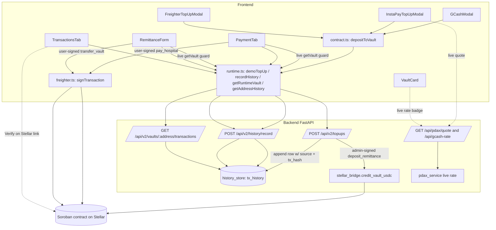

# Design Document

## Overview

SaloMed has regressed so that no top-up completes end to end. This feature restores and hardens every money movement — the three top-up methods (GCash, InstaPay/PDAX, Freighter XLM deposit), hospital payment, and remittance/padala — so that each one reliably settles, is fully traceable on Stellar, and records the method behind every top-up.

**Fix philosophy: logic and reliability only, no UI redesign.** The existing components (`VaultCard`, `GCashModal`, `InstaPayTopUpModal`, `FreighterTopUpModal`, `PaymentTab`, `RemittanceForm`, `TransactionsTab`) keep their current layout, copy, and interaction flow. The work happens in the seams: the frontend lib layer (`frontend/lib/runtime.ts`, `frontend/lib/contract.ts`), the backend runtime API (`backend/runtime_api.py`), the history index (`backend/history_store.py`), the admin bridge (`backend/stellar_bridge.py`), and the rate service (`backend/pdax_service.py`). No user-facing label will ever contain the words "simulated", "fake", "mock", or "demo".

Two reliability guarantees anchor the design:

1. **Reliability** — every vault-affecting transaction either settles on-chain and returns a real Stellar `Transaction_Hash`, or fails with a descriptive error that leaves the vault balance unchanged. There is no silent partial success.
2. **Traceability** — every recorded transaction carries its real tx hash, its settlement network (testnet vs mainnet), and for top-ups the method label ("Top-up via GCash / InstaPay / Freighter Wallet"), so each row is independently verifiable on the Stellar explorer.

This is grounded in the codebase as it exists today. The top-up modals already call `depositToVault()` (`frontend/lib/contract.ts`), which delegates to `demoTopUp()` (`frontend/lib/runtime.ts`) → `POST /api/v2/topups`. In non-demo modes that endpoint credits the vault through the admin bridge (`stellar_bridge.credit_vault_usdc`) and records the row in `history_store`. Payment and padala are user-signed through Freighter (`submitContractCall` → `contractPayment` / `contractVaultTransfer`). The design keeps those pathways and closes the specific gaps that break reliability and traceability.

## Architecture

Two distinct settlement patterns already exist in the code and are preserved:

- **Admin-funded top-up path** (GCash, InstaPay, Freighter deposit): the user does not sign. The frontend calls `depositToVault()` → `demoTopUp()` → `POST /api/v2/topups`. In Stellar modes the backend admin key signs `deposit_remittance(admin, beneficiary, amount)` via `stellar_bridge.credit_vault_usdc()`, producing a real tx hash. The backend records the row in `history_store`.
- **User-signed payment / padala path**: the frontend builds a Soroban transaction (`submitContractCall` in `runtime.ts`), Freighter signs it (`frontend/lib/freighter.ts` `signTransaction`), and it is submitted to the network. The returned hash is recorded through `recordHistory()` → `POST /api/v2/history/record`.

Both paths converge on the same append-only, address-keyed `history_store`, which `TransactionsTab` reads back through `getAddressHistory()`.



The mode gate lives in `RuntimeSettings.mode` (`backend/salomed_runtime.py`) and is mirrored to the frontend via `GET /api/runtime` (`getRuntimeStatus` in `runtime.ts`). `VaultCard` already shows GCash in `demo` and `stellar_testnet`, and InstaPay + Freighter deposit only in `stellar_testnet`. Real on-chain settlement and real tx hashes are produced in the Stellar modes, which is where traceability requirements apply.

## Components and Interfaces

### Frontend

- **`frontend/lib/contract.ts` — `depositToVault(userAddress, amountAsset, source)`**: gains a `source` parameter (`'gcash' | 'instapay' | 'freighter'`) threaded to `demoTopUp`. Keeps returning the settlement id / tx hash. `payHospital` and `sendPadala` are unchanged in signature.
- **`frontend/lib/runtime.ts`**:
  - `demoTopUp(address, amountPhp, source)`: adds `source` to the `POST /api/v2/topups` body.
  - `recordHistory(row)`: gains an optional `source` field passed through to `POST /api/v2/history/record` (used so the user-signed paths and any client-side top-up recording can carry a label).
  - `getAddressHistory(address)`: `HistoryRow` gains `source: string | null`.
  - New helper `convertPhpToAssetLive(amountPhp)` and `convertAssetToPhpLive(amountAsset)` that call the live-rate endpoint and **throw** a descriptive error when the rate is not live (Req 10.3).
- **Top-up modals** (`GCashModal`, `InstaPayTopUpModal`, `FreighterTopUpModal`): pass their method constant into `depositToVault(...)`. No layout change. The InstaPay modal keeps its two-branch behavior (`pdaxConfirm` real settlement first, else `depositToVault`).
- **`PaymentTab` / `RemittanceForm`**: keep the live `getVault()` re-read guard before signing. `RemittanceForm` is updated to perform the same live `getVault()` re-read that `PaymentTab` already does (today it guards only on the passed-in `vault` prop).
- **`TransactionsTab`**: renders the top-up method label when `type === 'topup'` using `source`, falling back to the current "Vault top-up" text when `source` is null. `explorerTxUrl` / `networkBadgeLabel` from `frontend/lib/stellar-links.ts` continue to build the Verify link and the per-row network badge.
- **`frontend/lib/stellar-links.ts`**: unchanged behavior; already builds the correct `stellar.expert/explorer/{testnet|public}/tx/{hash}` URL from `STELLAR_NETWORK_KIND` (`frontend/lib/config.ts`) and returns `''` for non-hash identifiers.

### Backend

- **`backend/runtime_api.py`**:
  - `TopUpRequest` gains `source: str | None` (validated against an allow-list).
  - `POST /api/v2/topups` passes `source` into `history_store.record(...)` in Stellar modes, and into `demo_ledger.topup(...)` in demo mode.
  - New strict rate behavior for the credited amount: PHP→asset conversion for the credit uses the live rate and raises `RATE_UNAVAILABLE` when a live rate is not available (Req 10.3), instead of the current silent fallback to `settings.php_per_asset_decimal`.
  - `HistoryRecordRequest` gains `source: str | None`.
- **`backend/history_store.py`**: `record(...)` and `history(...)` gain a `source` column (see Data Model). An idempotent migration adds the column to existing tables without dropping data.
- **`backend/salomed_runtime.py`**: `DemoLedger.topup` / `PostgresLedger.topup` accept and store `source` so demo-mode GCash top-ups also label correctly; `history()` returns it.
- **`backend/stellar_bridge.py`**: unchanged interface (`credit_vault_usdc`, `ensure_fee_funds`, `is_bridge_configured`). It already raises `BridgeError` on any failure, which the endpoint maps to `ONCHAIN_CREDIT_FAILED` without touching the vault.
- **`backend/pdax_service.py`**: `get_php_to_asset_quote` already returns `source: 'pdax_live' | 'indicative'`. A thin backend helper treats a non-`pdax_live` result as an error for credit conversions.

## Data Models

### `history_store.tx_history` (current + new column)

Current columns (from `backend/history_store.py`): `id`, `address`, `type`, `direction`, `amount_asset`, `amount_php`, `counterparty`, `tx_hash`, `status`, `created_at`.

**New column: `source TEXT NULL`.**

Decision — add a dedicated `source` column rather than reuse `counterparty`:

- `counterparty` already has a stable meaning: the other party in a payment/padala (an address or provider name), and `TransactionsTab` maps it to the row label for those types. Overloading it for a top-up method would blur that meaning and risk mislabeling.
- A dedicated nullable column keeps the store **append-only and backward compatible**: existing rows read back with `source = NULL` and render with today's generic "Vault top-up" text. No existing row is rewritten.
- The addition is done with an **idempotent migration** so already-deployed databases upgrade in place:
  - SQLite: check `PRAGMA table_info(tx_history)`; if `source` is absent, `ALTER TABLE tx_history ADD COLUMN source TEXT`.
  - PostgreSQL: `ALTER TABLE tx_history ADD COLUMN IF NOT EXISTS source TEXT`.
  - `CREATE TABLE IF NOT EXISTS` for fresh databases includes `source TEXT`.

Allowed `source` values (stored lower-case) and their user-facing labels:

| stored `source` | Transaction_Method_Label |
| --- | --- |
| `gcash` | Top-up via GCash |
| `instapay` | Top-up via InstaPay |
| `freighter` | Top-up via Freighter Wallet |
| `null` / unknown | Vault top-up (existing fallback) |

The label map is the single source of truth (frontend, in `TransactionsTab` or a small helper in `stellar-links.ts`/`format.ts`). It never emits the forbidden words.

The demo ledger `transactions` table (`backend/salomed_runtime.py`) gets the same additive `source` column so demo-mode GCash top-ups also carry the label; its positional `INSERT INTO transactions VALUES (...)` is changed to an explicit column list to remain correct after the addition.

### `TopUpRequest` / top-up response (after `source` addition)

Request (`backend/runtime_api.py`):

```python
class TopUpRequest(BaseModel):
    beneficiary_address: str
    amount_php: Decimal = Field(gt=0, max_digits=12, decimal_places=2)
    idempotency_key: str = Field(min_length=8, max_length=128)
    source: str | None = Field(default=None, max_length=16)  # gcash | instapay | freighter
```

Response (unchanged shape; already returns the real hash as `transaction_id`):

```jsonc
{
  "success": true,
  "mode": "stellar_testnet",
  "simulated": false,
  "transaction_id": "<real 64-hex Stellar tx hash>",
  "status": "completed",
  "beneficiary_address": "G...",
  "amount_php": "500.00",
  "amount_asset": "8.0357142",
  "asset_code": "USDC"
}
```

### `HistoryRow` (frontend, `runtime.ts`)

Gains `source: string | null`, mapped from the backend row. `TransactionsTab`'s existing `Transaction` mapping adds `topUpSource: r.source ?? undefined`.

## Method-Label Threading Design

The label must travel from each modal, through the frontend lib, to the backend store, and back to the render. The chain is:

1. **Modal → lib.** Each modal passes a fixed method constant:
   - `GCashModal.handleSimulatePayment` → `depositToVault(beneficiaryAddress, result.amount_xlm, 'gcash')`
   - `InstaPayTopUpModal.handleConfirm` (fallback branch) → `depositToVault(beneficiaryAddress, usdcOut, 'instapay')`
   - `FreighterTopUpModal.handleTopUp` → `depositToVault(address, parsedXlm, 'freighter')`
2. **`depositToVault(userAddress, amountAsset, source)`** (`contract.ts`) forwards `source` to `demoTopUp(userAddress, amountPhp, source)`.
3. **`demoTopUp`** (`runtime.ts`) includes `source` in the `POST /api/v2/topups` JSON body.
4. **`POST /api/v2/topups`** (`runtime_api.py`) validates `source` against the allow-list `{gcash, instapay, freighter}` (an out-of-range value is coerced to `null` rather than rejected, so a bad label never blocks a real credit) and passes it to the store:
   - Stellar modes: `history_store.record(address=..., tx_type="topup", ..., tx_hash=tx_hash, source=source)`.
   - Demo mode: `demo_ledger.topup(beneficiary, amount_php, idempotency_key, source=source)`.
5. **Storage** persists `source` in the dedicated column (append-only; see Data Model).
6. **Read + render.** `getAddressHistory` returns `source`; `TransactionsTab` maps `source` → label via the label map and shows "Top-up via {label}" for `type === 'topup'`, falling back to "Vault top-up" when `source` is null.

The InstaPay real-settlement branch (`pdaxConfirm` succeeded) is credited server-side in `pdax_api.py`; that path's `history_store.record` call is also given `source='instapay'` so both InstaPay branches label identically.

Allowed source values: exactly `gcash`, `instapay`, `freighter` (stored lower-case). Labels are defined once in the label map in the Data Model section.

## Traceability + Verify-on-Stellar Design

- **tx_hash into history rows.** The admin-funded top-up path records `tx_hash` = the hash returned by `stellar_bridge.credit_vault_usdc`. The user-signed paths record `tx_hash` = the hash returned by `submitContractCall` (`runtime.ts`), passed through `recordHistory` → `POST /api/v2/history/record` → `history_store.record`. Every vault-affecting row therefore carries a real hash; rows without a real hash are treated as non-verifiable (Req 7.2).
- **Explorer URL per network.** `frontend/lib/stellar-links.ts` builds `https://stellar.expert/explorer/{kind}/tx/{hash}` where `kind` is `STELLAR_NETWORK_KIND` from `frontend/lib/config.ts` (`'public'` when `NETWORK_PASSPHRASE === Networks.PUBLIC`, else `'testnet'`). `explorerTxUrl` returns `''` for anything that is not a 64-char hex hash, so `TransactionsTab` renders plain text instead of a dead link (Req 8.1–8.3).
- **Per-row network indicator.** `TransactionsTab` already renders a `Stellar {networkBadgeLabel()}` pill per row ("Testnet"/"Mainnet"), derived from the same `STELLAR_NETWORK_KIND`. This is kept and satisfies Req 8.4.

## Persistence Design

- **History follows the address.** `history_store` is keyed by `address` (upper-cased on write and read). On load, `TransactionsTab.refresh()` calls `getAddressHistory(address)` → `GET /api/v2/vaults/{address}/transactions` → `history_store.history(address)` (Stellar modes) or `demo_ledger.history(address)` (demo). Any device connecting the same Stellar address sees the same history (Req 9.2). A reload repeats this fetch, restoring the full history (Req 9.3).
- **Balance re-read.** On load and after each `salomed_tx_update` event, the vault balance is re-read from the contract via `getRuntimeVault` → `readContractVault` (`getVault` in `contract.ts`). Balance is never trusted from local cache for guards or display refresh, so it is restored on reload (Req 9.4).
- **Append-only guarantee at the store layer.** `history_store.record` only ever performs `INSERT`; there is no `UPDATE`/`DELETE`/upsert path. The design forbids adding one. Each row has a unique `id` (uuid4 hex). This is the enforced append-only invariant (Req 9.1).

## Live PHP ↔ XLM Conversion Design

- **Source of the rate.** The live rate comes from `pdax_service.get_php_to_asset_quote()` / `get_xlm_php_rate()` (`backend/pdax_service.py`), exposed to the frontend via `GET /api/pdax/quote` and `GET /api/gcash-rate`. The quote result carries `source: 'pdax_live' | 'indicative'`. `settings.php_per_asset_decimal` (from `PHP_PER_USDC`) is a configured constant, not a live rate.
- **Error behavior when the rate is unavailable (approved Req 10.3 — no fixed fallback).** For any conversion that determines a **vault-affecting credited amount**, the system requires `source === 'pdax_live'`. When the live rate cannot be retrieved:
  - Backend: the `POST /api/v2/topups` credit conversion raises `HTTPException(503, {error: "RATE_UNAVAILABLE", message: "Live PDAX rate unavailable; top-up cannot be completed."})` and performs no bridge call and no vault mutation.
  - Frontend: `convertPhpToAssetLive` / `convertAssetToPhpLive` throw the same descriptive error; the modal surfaces it and leaves the vault unchanged.
  - The current silent fallback to `settings.php_per_asset_decimal` for the credited amount is removed. Purely indicative **display** previews (e.g. the badge in `VaultCard`/`InstaPayTopUpModal`) may still show an indicative figure clearly badged "Indicative rate", but they can never be used to settle a credit.
- Never a 1:1 rate: conversions always divide/multiply by the live PHP-per-asset rate (Req 10.2).

## Insufficient-Balance Guard Design

- **Where the check happens.** Before Freighter opens for signing, both flows re-read the live on-chain balance via `getVault(address)` (`contract.ts` → `getRuntimeVault` → `readContractVault`) and compare the requested amount to the live balance:
  - `PaymentTab.handleGeneratePay` and `handleManualPay` already do this live re-read and block with "Not enough vault balance…" when `amount > liveXlm`.
  - `RemittanceForm.handleSend` is updated to perform the same live `getVault()` re-read (today it only checks the passed-in `vault` prop, which can be stale). On insufficient balance it blocks before `sendPadala` and shows the descriptive "Insufficient locked vault balance." message.
- The guard runs strictly before any signing call, so the user is never asked to sign a doomed transaction (Req 11.1, 11.2). Because the on-chain contract also rejects over-balance spends, the vault stays ≥ 0 in all cases (Req 11.3).

## Correctness Properties

*A property is a characteristic or behavior that should hold true across all valid executions of a system — essentially, a formal statement about what the system should do. Properties serve as the bridge between human-readable specifications and machine-verifiable correctness guarantees.*

These properties target the pure, input-varying parts of this feature: the label map and explorer-link helpers (pure functions), and the append-only address-keyed store and demo ledger (deterministic, in-memory, high-value invariants). The on-chain settlement, bridge, live-rate fetch, and reload durability are covered by integration/edge tests in the Testing Strategy rather than properties, because their behavior does not vary meaningfully across 100+ generated inputs. The set below was consolidated to remove redundancy (field-preservation, append-only, and address partitioning are unified into one round-trip property; the label-mapping and forbidden-word checks are one property; hash validity and network-segment checks are one property; balance delta and non-negativity are one property).

### Property 1: Idempotent top-up credit

*For any* valid beneficiary address, positive PHP amount, and idempotency key, submitting the same top-up request more than once with that identical key SHALL credit the vault exactly once, and every replay SHALL return the original transaction result.

**Validates: Requirements 1.4, 2.4**

### Property 2: History is append-only, address-partitioned, and field-preserving

*For any* sequence of recorded transactions across one or more Stellar addresses, reading a given address's history SHALL return exactly the rows recorded for that address (never another address's rows), with count equal to the number recorded and every prior row's `id`, `tx_hash`, and `source` preserved unchanged and never deleted or overwritten.

**Validates: Requirements 4.1, 5.2, 6.2, 9.1, 9.2**

### Property 3: Top-up method label is total and safe

*For any* stored source value — `gcash`, `instapay`, `freighter`, `null`, or any unknown string — the label function SHALL return exactly the mapped label for the three known sources and a generic top-up label otherwise, and the returned label SHALL never contain the substrings "simulated", "fake", "mock", or "demo" (case-insensitive).

**Validates: Requirements 4.2, 4.3, 4.4, 4.5**

### Property 4: Verify link validity and network correctness

*For any* string, the explorer link helper SHALL produce a non-empty URL if and only if the string is a real 64-character hexadecimal Stellar transaction hash, and *for any* real hash and network kind in `{testnet, public}` the URL SHALL contain the segment `/explorer/{kind}/tx/{hash}` matching that kind.

**Validates: Requirements 7.2, 8.1, 8.2, 8.3**

### Property 5: Ledger balance arithmetic and non-negativity

*For any* sequence of top-up, payment, and remittance operations on the ledger, each successful operation SHALL change the affected vault balance by exactly its amount (top-up increases, payment/padala decreases the sender), the vault balance SHALL never become negative, and any operation that would drive a balance below zero SHALL be rejected without mutating any balance.

**Validates: Requirements 5.3, 6.3, 11.3**

### Property 6: Pre-sign insufficient-balance guard

*For any* live vault balance B and requested payment or padala amount A, the pre-sign guard SHALL block the transaction if and only if A exceeds B, and when blocked it SHALL not invoke the signing path and SHALL leave the balance unchanged.

**Validates: Requirements 11.1, 11.2**

### Property 7: Live-rate conversion is proportional and never fixed 1:1

*For any* positive PHP amount and any positive live PHP-per-asset rate, the PHP→asset conversion SHALL equal the amount divided by the rate (within asset rounding), so the result equals the input amount only when the rate is exactly 1.

**Validates: Requirements 10.1, 10.2**

## Error Handling

All error paths are descriptive and leave the vault balance unchanged. Errors are surfaced as `HTTPException` with a `{error, message}` detail (matching the existing `_ledger_call` convention in `runtime_api.py`) and rendered by the modals' existing error UI.

| Condition | Where detected | Behavior | Balance effect |
| --- | --- | --- | --- |
| Bridge not configured | `POST /api/v2/topups` (`is_bridge_configured()` false) | `503 BRIDGE_NOT_CONFIGURED` with a descriptive message; no bridge call | Unchanged |
| On-chain credit failed | `stellar_bridge.credit_vault_usdc` raises `BridgeError` | `502 ONCHAIN_CREDIT_FAILED` with the bridge message; no history row written | Unchanged (Req 1.3, 2.3, 3.4) |
| Live rate unavailable | credit conversion (`source != 'pdax_live'`) | `503 RATE_UNAVAILABLE`; no bridge call, no mutation; **no fixed fallback** (approved Req 10.3) | Unchanged |
| Insufficient balance (server) | demo ledger `payment`/`remittance` | `409 INSUFFICIENT_VAULT_BALANCE`; atomic, no mutation | Unchanged |
| Insufficient balance (client, pre-sign) | `PaymentTab` / `RemittanceForm` live `getVault` guard | Block before Freighter opens; descriptive "insufficient balance" message | Unchanged (Req 11.1–11.3) |
| Freighter rejected / no signature | `submitContractCall` / `signTransaction` | Throw readable error; nothing recorded | Unchanged (Req 5.4, 6.4) |
| Contract rejected on-chain | `submitContractCall` (FAILED status) | Throw "contract rejected" error | Unchanged |
| Non-real tx hash | `explorerTxUrl` returns `''` | Row renders as plain text, no dead Verify link | N/A (Req 7.2) |
| Idempotency key reused for a different request | store `_replay` | `409 IDEMPOTENCY_CONFLICT` | Unchanged |
| History index write fails | `recordHistory` catch (non-fatal) | Swallowed; on-chain settlement already succeeded, local record still works | Unchanged |

## Testing Strategy

The regression guardrail (approved Req 12.3) requires automated tests covering all five flows so a regression in one is detected. Tests use the existing patterns and locations.

### Backend (pytest, `backend/tests/`)

Follows the `TestClient` + `RuntimeSettings(mode=DEMO)` + `DemoLedger(tmp_path)` pattern already established in `backend/tests/test_runtime_api.py`. New/extended tests:

- **`test_runtime_api.py` (extend)**
  - Top-up `source` persistence: POST `/api/v2/topups` with `source` in `{gcash, instapay, freighter}`; assert the recorded history row carries that source, and an unknown/absent source stores `null`.
  - Idempotency (Property 1): same key twice credits once and replays the original result (extends the existing idempotency test to also assert `source` on replay).
  - History recording present for all five flows: topup, payment, padala each produce the expected address-keyed rows (extends the existing durable-restart test which already asserts two-sided padala + payment + topup rows survive a store restart → also covers Req 9.3/9.4).
- **`test_topup_source.py` (new)** — the admin-funded credit path with `stellar_bridge` mocked:
  - Bridge success → endpoint returns `transaction_id` = mocked hash and records a row with `source` and `tx_hash` (Req 1.1, 2.1, 3.x, 7.3 via mock).
  - Bridge raises `BridgeError` → `502 ONCHAIN_CREDIT_FAILED`, no row, balance unchanged (Req 1.3, 2.3, 3.4).
  - Bridge not configured → `503 BRIDGE_NOT_CONFIGURED`, no mutation.
  - Rate not live → `503 RATE_UNAVAILABLE`, no bridge call, no mutation (approved Req 10.3).
- **`test_history_store.py` (new)** — store-level property and unit tests (Property 2, Property 5) against a temp SQLite DB, including the idempotent `source` migration on a pre-existing table (create table without `source`, run `_init`/migration, insert, read back).

### Property-based tests

Use **Hypothesis** (Python, backend) and **fast-check** (TypeScript, frontend). Each property test runs a **minimum of 100 iterations** and is tagged with a comment referencing its design property:

`# Feature: reliable-traceable-transactions, Property <number>: <property text>`

| Property | Library | Location |
| --- | --- | --- |
| P1 Idempotent top-up credit | Hypothesis | `backend/tests/test_history_store.py` / `test_runtime_api.py` |
| P2 Append-only, address-partitioned, field-preserving | Hypothesis | `backend/tests/test_history_store.py` |
| P3 Label map total & safe | fast-check | `frontend/lib/__tests__/topup-label.test.ts` |
| P4 Verify link validity & network segment | fast-check | `frontend/lib/__tests__/stellar-links.test.ts` |
| P5 Ledger balance arithmetic & non-negativity | Hypothesis | `backend/tests/test_history_store.py` (demo ledger) |
| P6 Pre-sign insufficient-balance guard | fast-check | `frontend/lib/__tests__/balance-guard.test.ts` (guard extracted as a small pure predicate) |
| P7 Live-rate conversion proportional & never 1:1 | Hypothesis / fast-check | backend rate helper test |

The library choice is standard for each ecosystem; property tests are not implemented from scratch.

### Frontend checks

- `npm run build` and TypeScript type-check (`tsc --noEmit`) must pass for the touched components and lib modules — this is the primary "other flows still compile/work" guardrail (Req 12.1, 12.2). Suggested single-run commands (run manually, not in watch mode): `npm run lint` and `npx tsc --noEmit`.
- The label map, explorer-link helpers, and the balance-guard predicate are pure and unit/property tested with **vitest + fast-check** (single-run: `vitest run`).

### Contract

The Soroban `pay_hospital` / `transfer_vault` / `deposit_remittance` behaviors (native-XLM settlement, over-balance rejection) are already covered in `contracts/salomed/src/tests.rs`; these are referenced, not duplicated, for Req 5.1/6.1/7.4.

## Requirements Traceability

| Design section | Requirements satisfied |
| --- | --- |
| Overview | 4.5 (label wording), 7 (real settlement intent), 12 (reliability intent) |
| Architecture | 1.1, 2.1, 3.1, 5.1, 6.1, 7.1, 7.3, 7.4 |
| Components and Interfaces | 1–8, 10, 11 (interface points for all flows) |
| Data Models | 4.1, and the `source`/`TopUpRequest` shapes underpinning 4.2–4.4 |
| Method-Label Threading | 4.1, 4.2, 4.3, 4.4, 4.5 |
| Traceability + Verify-on-Stellar | 7.1, 7.2, 8.1, 8.2, 8.3, 8.4 |
| Persistence | 9.1, 9.2, 9.3, 9.4 |
| Live PHP ↔ XLM Conversion | 10.1, 10.2, 10.3 (approved: error, no fixed fallback) |
| Insufficient-Balance Guard | 11.1, 11.2, 11.3 |
| Correctness Properties | 1.4, 2.4, 4.1–4.5, 5.2, 5.3, 6.2, 6.3, 7.2, 8.1–8.3, 9.1, 9.2, 10.1, 10.2, 11.1, 11.2, 11.3 |
| Error Handling | 1.3, 2.3, 3.4, 5.4, 6.4, 7.2, 10.3, 11.1–11.3 |
| Testing Strategy | 1.1–3.4 (integration/mocked), 9.3, 9.4, 12.1, 12.2, 12.3 (all five flows) |

Every acceptance criterion in requirements.md is mapped to at least one design section above.
