# LusogChain

> **Every receipt, permanently verified.**
>
> **Live Demo:** [https://wolfsenberg.github.io/LUSOGCHAIN/frontend/](https://wolfsenberg.github.io/LUSOGCHAIN/frontend/)

---

## Proof of Work

### ✅ Contract Tests — All Passing

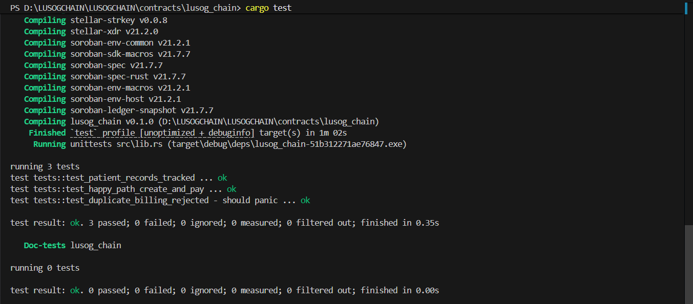

3 unit tests passing: `test_happy_path_create_and_pay`, `test_duplicate_billing_rejected`, `test_patient_records_tracked`

---

### ✅ Deployment to Stellar Testnet

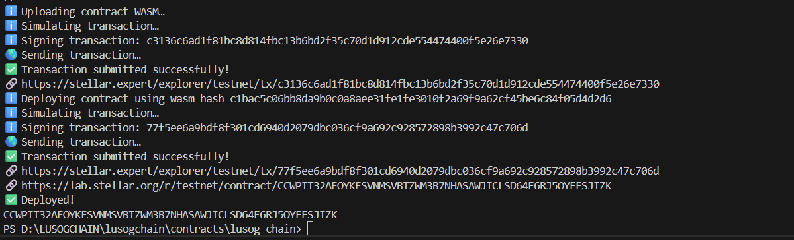
*WASM uploaded, contract deployed, transaction submitted successfully.*

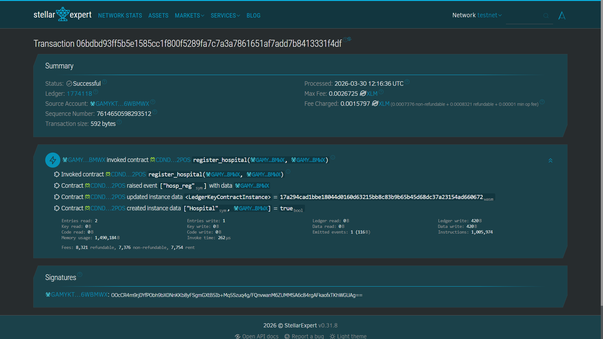
*Verified on Stellar Expert — `register_hospital` invocation confirmed on-chain.*

**Contract ID (Testnet):**
```
CDND234UYOEJJVXWBALEZDS7PIUU6XPF5KJFS5TD4D5RNETVHUUZ2POS
```

| | |
|---|---|
| **Network** | Stellar Testnet |
| **Explorer** | [View on Stellar Expert](https://stellar.expert/explorer/testnet/contract/CDND234UYOEJJVXWBALEZDS7PIUU6XPF5KJFS5TD4D5RNETVHUUZ2POS) |
| **Deploy Tx** | [327fe117...](https://stellar.expert/explorer/testnet/tx/327fe1176aebde07c0d3deca166832456c1836197df596807468eb09d9baad57) |

---

## App Flow

### 1. Landing Page
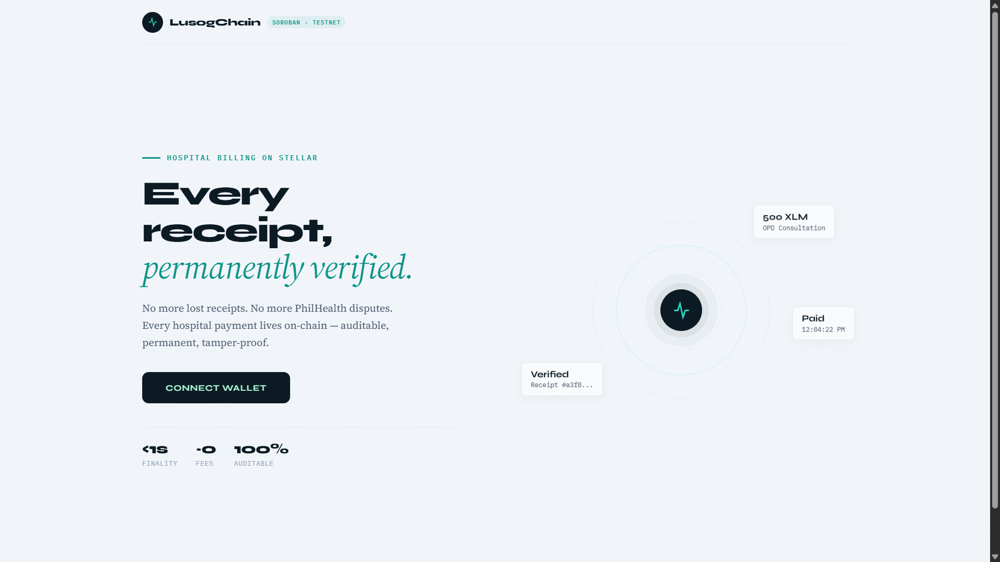
*The landing page before connecting a wallet. Animated pulse rings, floating receipt cards, and key stats.*

---

### 2. Connect Wallet — Freighter Extension
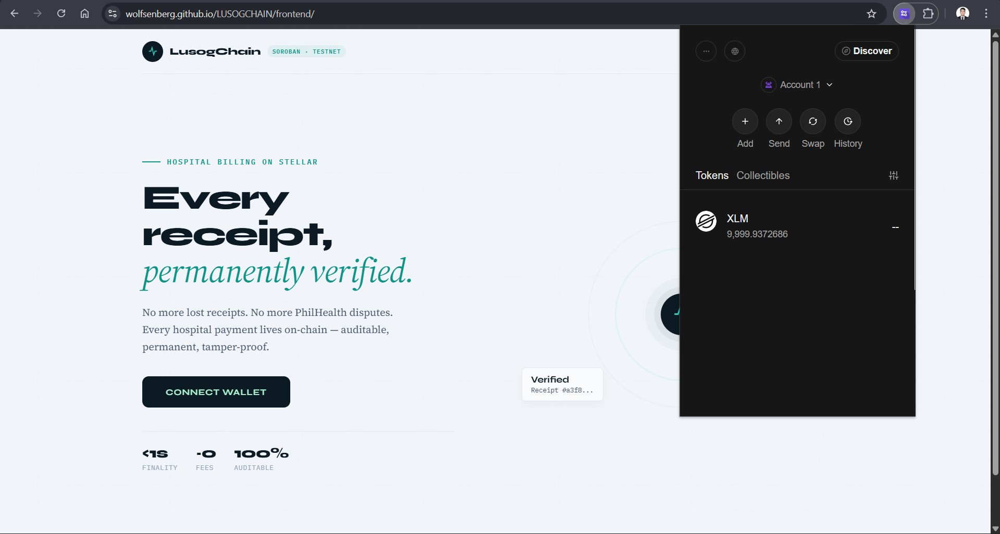
*Clicking "Connect Wallet" opens the Freighter extension. The user selects their account and approves the connection.*

---

### 3. Dashboard — Connected
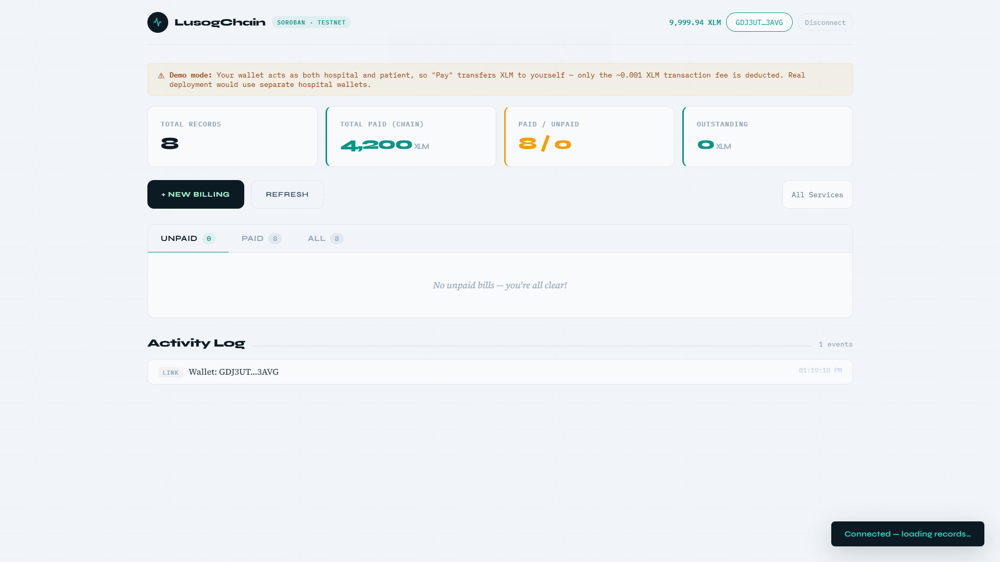
*After connecting, the dashboard loads with stat cards (Total Records, Total Paid, Paid/Unpaid, Outstanding) and the billing table tabs.*

---

### 4. New Billing Record Modal
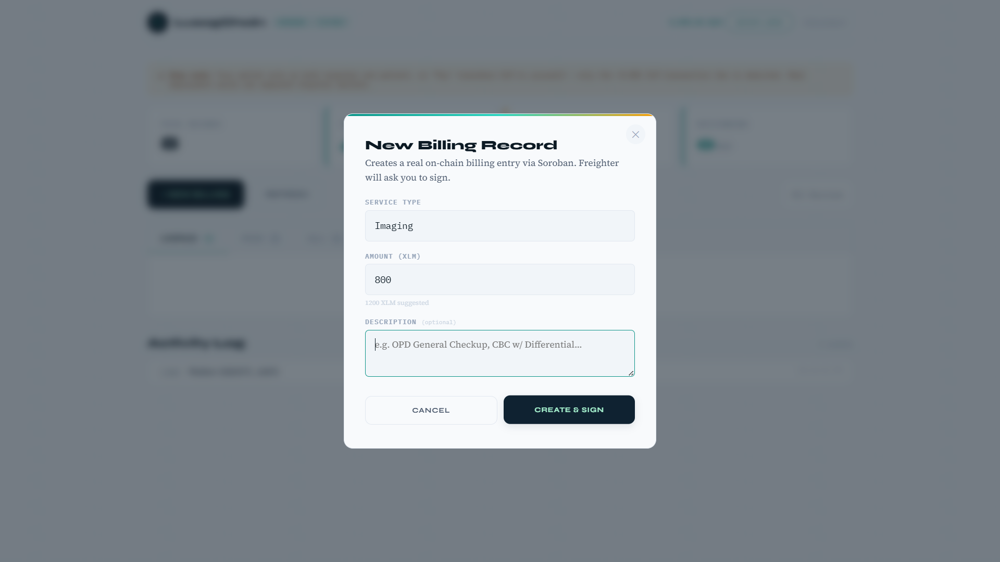
*Clicking "+ New Billing" opens the modal. Select a service type, enter an amount in XLM, and optionally add a custom description.*

---

### 5. Freighter Signing — Create Billing
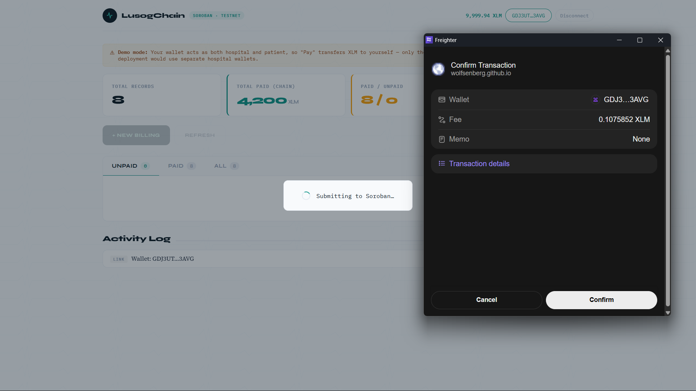
*Freighter pops up to confirm the transaction. Shows the wallet, fee (~0.1 XLM), and transaction details before signing.*

---

### 6. Unpaid Bill Appears
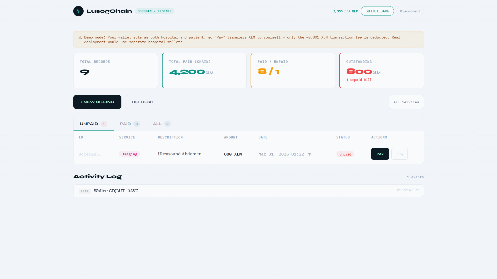
*After the transaction confirms, the page reloads. The new bill appears under the Unpaid tab with service type, description, amount, and a Pay button.*

---

### 7. Paying a Bill — Submitting
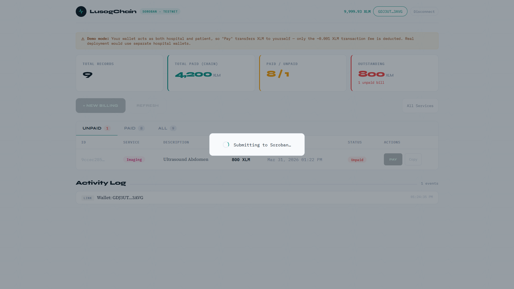
*Clicking "Pay" triggers the payment flow. The "Submitting to Soroban…" overlay appears while the transaction is being processed.*

---

### 8. Freighter Signing — Pay Bill
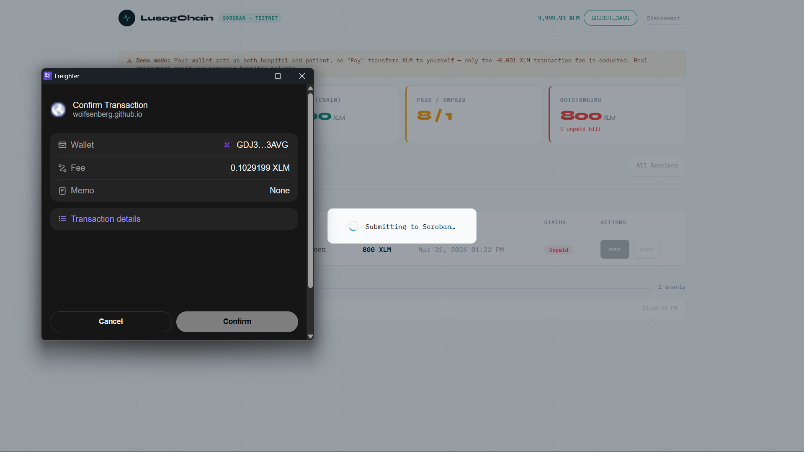
*Freighter prompts again to confirm the payment transaction with fee details.*

---

### 9. Paid Tab — Bills Confirmed
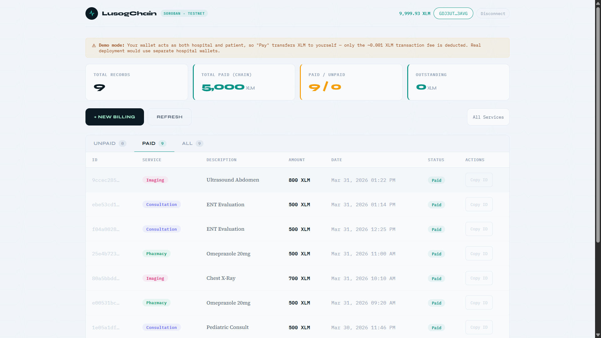
*After payment confirms, the page reloads. Bills move to the Paid tab. Stats update: Total Paid shows 5,000 XLM, Paid/Unpaid shows 9/0.*

---

### 10. On-Chain Receipt
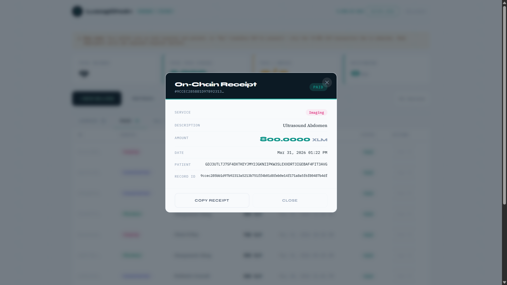
*Clicking any row opens the on-chain receipt modal. Shows service, description, amount, date, patient address, and full record ID. Includes a "Copy Receipt" button.*

---

### 11. Service Filter
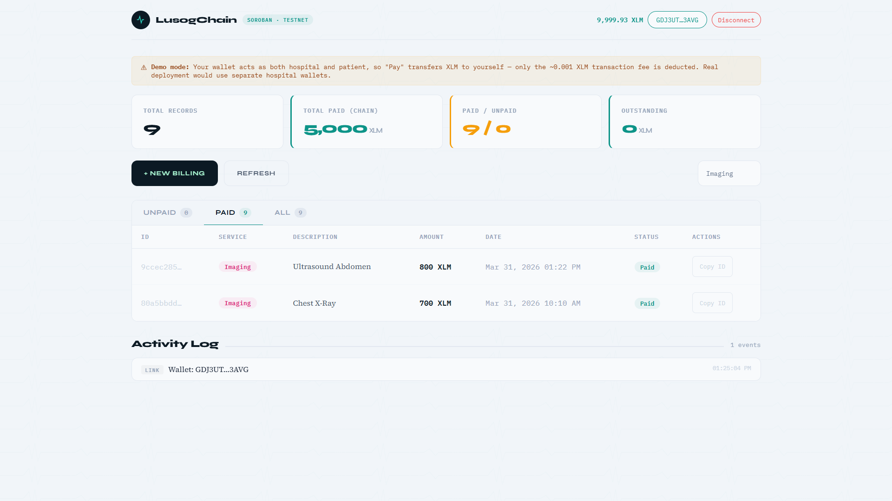
*The filter dropdown lets you narrow records by service type. Shown here filtered to "Imaging" only.*

---

### 12. Disconnect — Back to Landing
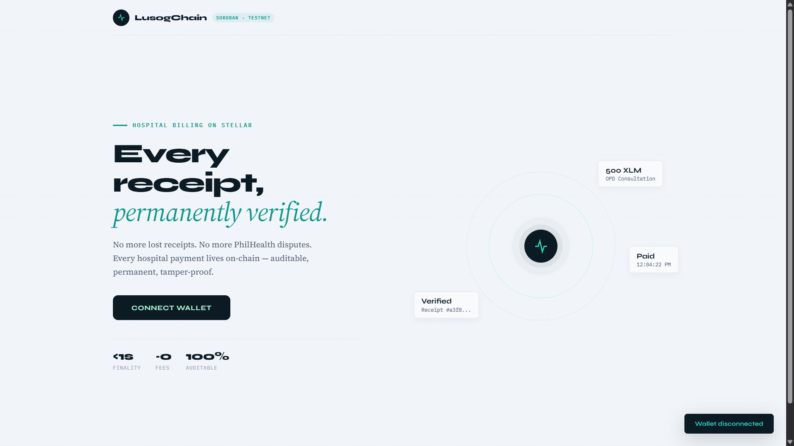
*Clicking the LusogChain logo disconnects the wallet and returns to the landing page. A "Wallet disconnected" toast confirms the action.*

---

## What is LusogChain?

LusogChain is a decentralized hospital billing system built on the **Stellar network** using **Soroban smart contracts**. It transforms traditional hospital bills into immutable on-chain records — giving patients permanent, tamper-proof proof of payment and helping healthcare providers maintain a fully transparent billing history.

No more lost receipts. No more PhilHealth disputes. Every payment lives on-chain.

---

## Table of Contents

- [Purpose](#purpose)
- [Key Features](#key-features)
- [Tech Stack](#tech-stack)
- [Project Structure](#project-structure)
- [Setup & Local Development](#setup--local-development)
- [Usage Guide](#usage-guide)
- [Smart Contract Reference](#smart-contract-reference)
- [How Stellar Powers LusogChain](#how-stellar-powers-lusogchain)

---

## Purpose

In traditional healthcare settings — especially locally with PhilHealth or HMOs — misplaced physical receipts, reconciliation errors, and billing disputes are a constant friction point.

LusogChain aims to eliminate these problems by:

- Providing a **transparent on-chain ledger** for hospital billings
- Giving patients **instant, verifiable proof of payment**
- Helping hospitals maintain an **automated, tamper-proof history** of all services rendered
- Eliminating reliance on centralized systems prone to data loss or manipulation

---

## Key Features

- **Instant Finality** — Billing records and payments settle on Stellar in under 5 seconds
- **100% Auditable** — All records are publicly verifiable on-chain
- **Self-Custodial** — Users pay directly from their own wallet; no middlemen, no hidden fees
- **Service Categorization** — Supports `Consultation`, `Laboratory`, `Pharmacy`, `Imaging`, and `Emergency`
- **On-Chain Receipts** — Every record includes a unique ID, service type, description, amount, timestamp, and payment status
- **Mobile-Ready** — Fully responsive UI for desktop, tablet, and mobile

---

## Tech Stack

| Layer | Technology |
|---|---|
| Blockchain | Stellar Soroban (Testnet) |
| Smart Contract | Rust + `soroban-sdk v21.7.6` |
| Frontend | Vanilla HTML / CSS / JavaScript |
| Wallet | Freighter (`@stellar/freighter-api v6`) |
| Stellar SDK | `@stellar/stellar-sdk v12` |
| RPC | Soroban RPC Testnet |
| Horizon | Horizon Testnet API |
| Currency | XLM (native Stellar token) |

---

## Project Structure

```
LUSOGCHAIN/
├── assets/                   # Screenshots and proof of work
├── contracts/
│   └── lusog_chain/
│       ├── src/
│       │   ├── lib.rs        # Core Soroban smart contract logic
│       │   └── tests.rs      # Contract unit tests (3 test cases)
│       ├── Cargo.toml        # Rust dependencies
│       └── .cargo/
│           └── config.toml   # WASM build flags
└── frontend/
    ├── index.html            # Complete single-file web application
    └── freighter.js          # Bundled Freighter API (browser-ready)
```

---

## Setup & Local Development

### Prerequisites

- [Rust](https://rustup.rs/) (stable toolchain + `wasm32-unknown-unknown` target)
- [Stellar CLI](https://developers.stellar.org/docs/tools/developer-tools/stellar-cli)
- [Freighter Wallet](https://www.freighter.app/) browser extension
- A modern browser (Chrome, Firefox, Brave)

### 1. Clone the repository

```bash
git clone https://github.com/wolfsenberg/LUSOGCHAIN.git
cd LUSOGCHAIN
```

### 2. Install the WASM build target

```bash
rustup target add wasm32-unknown-unknown
```

### 3. Run contract unit tests

```bash
cd contracts/lusog_chain
cargo test
```

Expected output:

```
test test_duplicate_billing_rejected ... ok
test test_happy_path_create_and_pay ... ok
test test_patient_records_tracked ... ok

test result: ok. 3 passed; 0 failed
```

### 4. Build the contract

```bash
stellar contract build
```

### 5. Deploy to testnet

```bash
stellar keys generate test-user --network testnet
stellar keys fund test-user --network testnet

stellar contract deploy \
  --wasm contracts/lusog_chain/target/wasm32-unknown-unknown/release/lusog_chain.wasm \
  --source test-user \
  --network testnet
```

Copy the returned Contract ID and update `CONTRACT_ID` in `frontend/index.html`.

### 6. Run the frontend

Open `frontend/index.html` directly in your browser, or serve it locally:

```bash
# Python
python -m http.server 8080

# Node.js
npx serve frontend/
```

No build step required — the frontend is a single self-contained HTML file.

---

## Usage Guide

### Step 1 — Connect your wallet
1. Install [Freighter](https://www.freighter.app/) and switch it to **Testnet**
2. Get free testnet XLM from [Stellar Friendbot](https://friendbot.stellar.org/)
3. Open the app and click **Connect Wallet**

### Step 2 — Create a billing record
1. Click **+ New Billing**
2. Select a **Service Type** and enter an **Amount** in XLM
3. Optionally add a custom **Description**
4. Click **Create & Sign** — Freighter will prompt you to approve
5. Page reloads automatically once confirmed on-chain

### Step 3 — Pay a bill
1. Find the bill under the **Unpaid** tab
2. Click **Pay** — Freighter will prompt you to sign
3. Once confirmed, the bill moves to the **Paid** tab

### Step 4 — View receipts
- Click any row to open the **On-Chain Receipt** modal
- Click **Copy Receipt** to copy a formatted plain-text receipt to clipboard

> **Demo mode note:** Your wallet acts as both hospital and patient — "Pay" transfers XLM to yourself, so only the ~0.001 XLM transaction fee is deducted. A production deployment would use separate registered hospital wallets.

---

## Smart Contract Reference

### Functions

| Function | Description |
|---|---|
| `initialize(admin, token_id)` | One-time contract setup |
| `register_hospital(admin, hospital)` | Register an authorized hospital wallet |
| `create_billing(hospital, patient, record_id, service, amount, description)` | Create a new billing record on-chain |
| `pay_bill(patient, record_id)` | Pay a bill — transfers XLM from patient to hospital |
| `verify_receipt(record_id)` | Fetch full billing record by ID |
| `get_patient_records(patient)` | Get all record IDs for a patient |
| `get_stats()` | Returns `(total_records, total_paid_in_stroops)` |

### Data Structures

```rust
pub struct BillingRecord {
    pub record_id:   BytesN<32>,
    pub patient:     Address,
    pub hospital:    Address,
    pub service:     ServiceType,
    pub amount:      i128,        // in stroops (1 XLM = 10,000,000 stroops)
    pub timestamp:   u64,
    pub paid:        bool,
    pub description: String,
}

pub enum ServiceType {
    Consultation,
    Laboratory,
    Pharmacy,
    Imaging,
    Emergency,
}
```

### Test the live contract via CLI

```bash
stellar contract invoke \
  --id CDND234UYOEJJVXWBALEZDS7PIUU6XPF5KJFS5TD4D5RNETVHUUZ2POS \
  --network testnet \
  --source test-user \
  -- get_stats
```

---

## How Stellar Powers LusogChain

1. **Soroban Smart Contracts** — The core billing logic runs entirely on-chain. Records are immutable once written; payment transfers are atomic and trustless.
2. **Freighter Wallet** — All transaction signing happens inside the user's browser extension. Private keys are never exposed to the application.
3. **XLM as Payment** — Native Stellar lumens are used for bill payments, leveraging Stellar's near-zero fees and sub-5-second finality.
4. **Stellar Testnet** — The app runs on Soroban RPC Testnet and Horizon Testnet, allowing full end-to-end testing with real transactions and no real funds at risk.
5. **Horizon API** — Used to fetch live XLM wallet balances displayed in the navigation bar.
