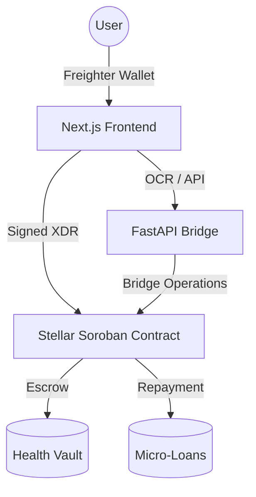

# SaloMed: Your Health Alkansya

> **The Problem: Ang sakit na nga, mas masakit pa sa bulsa.**
>
> For many Filipinos, saving up for emergencies is a major goal. However, the reality of having an easily accessible emergency fund is that temptation is always just a few taps away. It's incredibly easy to justify a sudden online purchase, an impromptu dinner out, or a gadget upgrade.
>
> Before you know it, the savings start getting chipped away. The real problem hits when a sudden medical emergency arises. Because the funds have been spent, there is no money left for hospital bills or expensive prescriptions. The inevitable ending? People resort to borrowing. **Napipilitan tayong mangutang.** It leads to high-interest debt, adding massive emotional and financial stress to the family.
>
> This issue extends to remittances as well. When a family member sends money specifically for healthcare—whether it's an OFW abroad or an older sibling working in Manila—there is always the lingering fear of funds being misspent. **Pampa-checkup sana, pero nabili ng luho.** The sender has no guarantee that the money was actually used for medicine.

**The Solution: Enter SaloMed: Your Health Alkansya**

SaloMed is a purpose-built digital health alkansya (piggy bank). It functions just like the e-wallets we use every single day, but with one massive difference: the money you put in here is strictly locked and can only be spent on healthcare.

Think of it as the ultimate discipline tool for your health savings. We give you a super familiar, frictionless e-wallet experience, but quietly empower it with an unbreakable layer of smart contracts running on the Stellar Network.

**Live App:** [https://salomedhealthalkansya.vercel.app/](https://salomedhealthalkansya.vercel.app/)

**Pitch Document:** [Google Docs](https://docs.google.com/document/d/134i9LdSE-X0jaV2Nr0X9SSptM7tY4yRtdCkYO2t2260/edit?usp=sharing)

---

## Key Features

### 1. Health Vault (The Alkansya)
The core of SaloMed is an escrow vault for a single user. Users save funds in a decentralized vault protected by a smart contract. These funds are reserved for health emergencies, ensuring financial readiness when medical needs arise.

### 2. Direct-to-Hospital Payments
Pay the clinical gap directly to whitelisted hospitals and pharmacies using Stellar. Payments are atomic and near-instant, generating permanent on-chain receipts for every transaction.

### 3. SaloPoints and Micro-Loans
Every successful saving or payment transaction earns the user SaloPoints.
*   **Credit Tiers**: Accumulating points moves users through Bronze, Silver, and Gold tiers.
*   **Emergency Loans**: Users can apply for micro-loans based on their current credit tier if their vault balance is insufficient to cover a medical bill.

### 4. Health Padala (Remittance)
Designed for OFWs and family members abroad. Send health-specific remittances directly into a loved one's SaloMed Vault. This ensures that the remittance is securely locked and reserved strictly for medical expenses.

---

## Target Market & Benefits

SaloMed creates a win-win-win ecosystem for the Filipino healthcare landscape.

### Target Market
*   **OFW Families**: Ensuring remittances are spent exactly where they are needed.
*   **Unbanked Filipinos**: Providing a simple, mobile-first entry into formal health savings.
*   **Healthcare Providers**: Hospitals and pharmacies looking for faster, atomic settlement.

### Key Benefits
*   **For Users**: Forced discipline through "locked" savings, instant credit building (SaloPoints), and a safety net via micro-loans.
*   **For Providers**: Zero risk of "check-bounce" or failed payments; funds are already escrowed. Reduced administrative time for billing and collections.
*   **For the Economy**: Improved health outcomes by promoting proactive saving, and increased financial inclusion through the Stellar blockchain.

---

## Tech Stack

| Layer | Technology |
|---|---|
| **Blockchain** | Stellar Soroban (Smart Contracts) |
| **Smart Contract** | Rust + `soroban-sdk` |
| **Frontend** | Next.js 14 (App Router), Tailwind CSS, Framer Motion |
| **Backend** | FastAPI (Python 3.11) |
| **Wallet** | Freighter Wallet |
| **Payments** | XLM and USDC (Stellar Assets) |
| **Deployment** | Vercel (Frontend), Render (Backend) |

---

---

## Architecture & Structure

SaloMed follows a hybrid architecture, combining a modern web frontend with a high-performance backend bridge and an unbreakable Soroban smart contract layer.



### Directory Structure
```
SaloMed/
├── backend/            # FastAPI server: OCR processing, QR generation, and GCash Bridge logic
├── contracts/          # Soroban Smart Contracts (Rust): Security and Escrow logic
│   └── salomed/        # Main SaloMed contract logic
├── frontend/           # Next.js 14 Application: Professional mobile-first UI
│   ├── app/            # App router, layouts, and pages
│   ├── components/     # High-fidelity React components
│   └── lib/            # Freighter and Contract interaction logic
└── README.md           # Documentation
```

---

## Demo Flow

Experience the SaloMed lifecycle in 5 easy steps:

1.  **Onboarding & Connection**: Connect your **Freighter Wallet**. If it's your first time, you'll see a professional onboarding walkthrough explaining the "Health Alkansya" concept.
2.  **The Top-Up**: Funding your vault is seamless. You can send XLM/USDC directly, or use our **GCash Bridge** simulation to "top up" your health savings.
3.  **Merchant Verification**: Using the **Bill Scanner**, scan a hospital invoice. SaloMed uses OCR-inspired logic to extract the provider's Stellar address and amount.
4.  **Atomic Payment**: Confirm the payment. The smart contract ensures funds are only released to whitelisted healthcare providers. If your balance is low, the UI will suggest a **Micro-Loan** or a **Top-Up**. 
5.  **Growth & History**: Every payment earns you **SaloPoints**, moving you from Bronze to Gold tiers, unlocking lower interest rates for future loans.

---

## Escrow Lifecycle

SaloMed is more than an e-wallet; it's a **strictly-locked health escrow**.

1.  **Inbound (Deposit)**: Funds enter the contract via `deposit_remittance`. The contract creates or updates a `Vault` entry associated with the user's public key.
2.  **Locking**: Unlike a standard wallet, these funds cannot be withdrawn to any arbitrary address. They are "locked" within the SaloMed contract storage.
3.  **Release Trigger (Payment)**: The `pay_hospital` function is the only gateway. It requires:
    *   A signed transaction from the Vault owner.
    *   A destination address that exists in the SaloMed **Provider Whitelist**.
4.  **Atomic Settlement**: The transfer happens atomically. The user's vault balance decreases, and the hospital's account increases in a single ledger entry.

---

## How Stellar Powers SaloMed

SaloMed isn't just an app; it's a financial protocol for health security, leveraged by the specific strengths of the Stellar Network:

*   **Immutable Discipline (Soroban)**: Our smart contracts act as an automated guardian. By hardcoding the "healthcare-only" rule on-chain, we eliminate the human temptation to spend emergency funds on non-essentials.
*   **Atomic Multi-Party Settlement**: Using Stellar's atomic operations, we ensure that a vault is only debited *if and only if* the whitelisted provider receives the funds. This creates instant trust in a zero-trust environment.
*   **Financial Inclusion via Micro-fees**: With transaction costs at a fraction of a cent, SaloMed remains viable for micro-savings and micro-loans that would be eaten up by fees on other networks or traditional banks.
*   **Asset Versatility**: By utilizing USDC for value stability and XLM for network utility, we provide a familiar, stable e-wallet experience backed by the transparency of a public ledger.
*   **Seamless Remittances (Path Payments)**: Stellar allows OFWs to send health-support in their local currency, arriving instantly as locked health-credits for their loved ones in the Philippines.

---

## Setup and Local Development

### 1. Prerequisites
*   Node.js 18+ and npm
*   Python 3.11+ (with Tesseract OCR engine installed)
*   Stellar CLI and Rust (for contract development)

### 2. Backend Setup
```bash
cd backend
python -m venv venv
source venv/bin/activate  # or venv\Scripts\activate on Windows
pip install -r requirements.txt
uvicorn main:app --reload
```

### 3. Frontend Setup
```bash
cd frontend
npm install
npm run dev
```
Update your `.env.local` with `NEXT_PUBLIC_API_URL` pointing to the FastAPI server.

---

## Smart Contract

**Contract ID (Testnet):** `CDND234UYOEJJVXWBALEZDS7PIUU6XPF5KJFS5TD4D5RNETVHUUZ2POS`

| Function | Description |
|---|---|
| `initialize` | Setup admin and token addresses |
| `deposit_remittance` | Remittance top-up for a beneficiary vault |
| `pay_hospital` | Atomic payment from vault to whitelisted hospital |
| `get_vault` | Fetch balance, SaloPoints, and credit tier |
| `whitelist_hospital` | Admin: Add authorized medical providers |

---

**SaloMed: Pondong protektado, kalusugan mo'y salo.**
